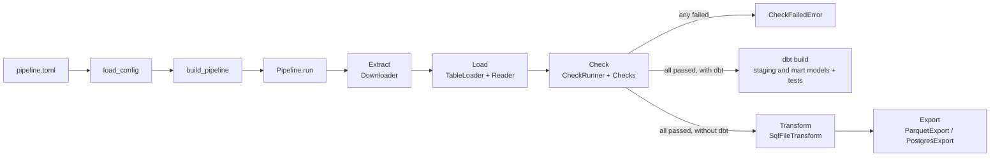

# duckpipe design

duckpipe loads any data DuckDB can read (CSV, Parquet, JSON, Excel) and checks it. Everything specific to one dataset lives in `pipeline.toml`; the `duckpipe/` package never changes for new data.

For the Airbnb project, dbt does the transforming: duckpipe handles extract, load and check, and dbt handles transform and test. duckpipe also has simple SQL transforms and exports of its own, for projects that don't use dbt.

## How data flows



This is ELT: raw data lands unchanged, checks run on the raw tables, and SQL (in dbt models, or in duckpipe's transform files) does the cleaning.

## Where dbt fits

`scripts/build.sh` runs the two tools in order: `python -m duckpipe pipeline.toml`, then `dbt build`. They're separate commands, not one program calling the other, because DuckDB allows only one program at a time to write to a database file. duckpipe has to finish and close `airbnb.duckdb` before dbt opens it.

```
dbt/
├── dbt_project.yml          project settings: staging models are views, marts are tables
├── profiles.yml             points dbt at airbnb.duckdb (no password needed)
└── models/
    ├── sources.yml          declares raw_listings, which duckpipe loads
    ├── staging/
    │   ├── stg_listings.sql      clean and type the raw data
    │   └── _stg_listings.yml     tests on stg_listings
    └── marts/
        └── mart_*.sql           one model per business question
```

- **Staging models** clean one source each: fix types, rename columns, drop personal fields.
- **Mart models** answer one business question each, built on staging models with `{{ ref('stg_listings') }}`. dbt reads those `ref`s to work out the build order itself.
- **dbt tests** check the models after they're built, just as duckpipe's checks guard the raw data before. `dbt build` runs each model and then its tests, and stops at the first failure.

Run `dbt docs generate` and then `dbt docs serve` to see a website of your models, with a lineage graph showing how each one is built.

## Classes and responsibilities

| Module | Class or function | One job | C# equivalent |
| --- | --- | --- | --- |
| `errors.py` | `PipelineError` and subclasses | Say what went wrong | Custom exception hierarchy |
| `sql_safety.py` | `validate_table_name`, `quote_identifier`, `string_literal`, `render_options` | Put names and text into SQL safely | What EF Core does for you behind LINQ |
| `connection.py` | `Connection`, `open_database` | The only place that opens a database | Injected `DbContext` |
| `config.py` | `PipelineConfig`, `SourceConfig`, `CheckConfig`, `OutputConfig`, `load_config` | Read and validate settings | Options classes bound from `appsettings.json` |
| `readers.py` | `Reader` (protocol), `TableFunctionReader`, `READERS`, `reader_for` | Describe how to read a file format | Interface + factory |
| `loader.py` | `TableLoader` | Create a raw table from files | A repository's "add" method |
| `checks.py` | `Check` (protocol), `RequiredColumns`, `NotNull`, `Unique`, `MinRows`, `CheckRunner`, `build_check` | Decide whether data can be trusted | FluentValidation rules + validator |
| `extract.py` | `Downloader` | Fetch files once, from trusted hosts | `HttpClient` wrapper service |
| `transforms.py` | `Transform` (protocol), `SqlFileTransform` | Run one SQL file | Ordered data migrations |
| `outputs.py` | `Output` (protocol), `ParquetExport`, `PostgresExport`, `PostgresSettings`, `build_output` | Send tables somewhere | Interface + implementations |
| `pipeline.py` | `Pipeline`, `build_pipeline` | Run stages in order; wire everything together | Orchestrating service; `Program.cs` registrations |
| `__main__.py` | `main` | Command line: `python -m duckpipe pipeline.toml` | `Main` |

## Where SOLID shows up

| Principle | In duckpipe |
| --- | --- |
| Single responsibility | Each class above has one job. `Pipeline` only coordinates; it does no loading, checking or SQL of its own. |
| Open/closed | A new file format, check or output is a new entry in `READERS`, `CHECK_TYPES` or `OUTPUT_TYPES`. Existing classes don't change. |
| Liskov substitution | Every `Reader` returns an expression usable after `FROM`; every `Check` returns a `CheckResult` and never raises for bad data; every `Output` takes the same arguments. Any one can replace another. |
| Interface segregation | Each protocol has one method (`table_expression`, `run`, `apply`, `write`). |
| Dependency inversion | Classes receive their connection, opener and collaborators through `__init__`. Only `build_pipeline` knows the concrete classes. |

One deliberate choice: there's a single `TableFunctionReader` instead of `CsvReader`, `ParquetReader` and so on, because those classes would differ only in data (the DuckDB function name and default options), not behaviour. Prefer configuring one class over writing near-identical copies.

## Python for a C# developer

| C# | Python here |
| --- | --- |
| `interface IReader` | `class Reader(Protocol)`: any class with matching methods counts, no `: IReader` needed |
| `record` | `@dataclass(frozen=True)` |
| `private` field | Leading underscore, `self._connection`: a convention, not enforced |
| `readonly` / `const` | `frozen=True` dataclasses, `Final`, tuples instead of lists |
| `static` method | `@staticmethod` |
| Property | `@property` |
| `IEnumerable<T>`, `IReadOnlyList<T>` | `Iterable[T]`, `Sequence[T]` |
| `IReadOnlyDictionary<K, V>` | `Mapping[K, V]` |
| Constructor injection | Same idea: pass collaborators to `__init__` |
| `DbContext` + LINQ | `Connection` + SQL strings, with `?` parameters for values |
| `appsettings.json` / user secrets | `pipeline.toml` / `.env` |
| EF Core migrations run in order | dbt models, with the order worked out from `ref()` |
| LINQ projection into a view model | A dbt mart model: a `select` that shapes data for one question |
| xUnit `[Theory]` + `[InlineData]` | `@pytest.mark.parametrize` |
| Moq | Small fake classes, like `FakeOpener` in `tests/test_extract.py` |
| `using` | `with` |

## Build order

Implement one module at a time, on its own branch, until its tests pass. Each step only depends on the ones before it.

| Step | Module | Run |
| --- | --- | --- |
| 1 | `sql_safety.py` | `python -m pytest tests/test_sql_safety.py` |
| 2 | `connection.py` | `python -m pytest tests/test_loader.py -k open_database` |
| 3 | `config.py` | `python -m pytest tests/test_config.py` |
| 4 | `readers.py` | `python -m pytest tests/test_readers.py` |
| 5 | `loader.py` | `python -m pytest tests/test_loader.py` |
| 6 | `checks.py` | `python -m pytest tests/test_checks.py` |
| 7 | `extract.py` | `python -m pytest tests/test_extract.py` |
| 8 | `transforms.py`, `outputs.py` | `python -m pytest tests/test_transforms_and_outputs.py` |
| 9 | `pipeline.py`, `__main__.py` | `python -m pytest tests/test_pipeline.py` |

When every test passes, `python -m duckpipe pipeline.toml` loads and checks the Airbnb data. Then:

| Step | Work | Run |
| --- | --- | --- |
| 10 | dbt project and `stg_listings` | `dbt build --project-dir dbt --profiles-dir dbt` |
| 11 | One-command build | `./scripts/build.sh` |
| 12 | One mart model per business question | `dbt build --select marts --project-dir dbt --profiles-dir dbt` |

## Extending it

- **New file format:** add one line to `READERS` and `SUPPORTED_FORMATS`.
- **New check:** write a small frozen dataclass with `name` and `run`, add it to `CHECK_TYPES`, and add a test.
- **New output:** write a class with `write`, add it to `OUTPUT_TYPES`, and add a test.
- **New dataset:** write a new `pipeline.toml`, plus either dbt models or `sql/` transform files. No Python changes.
